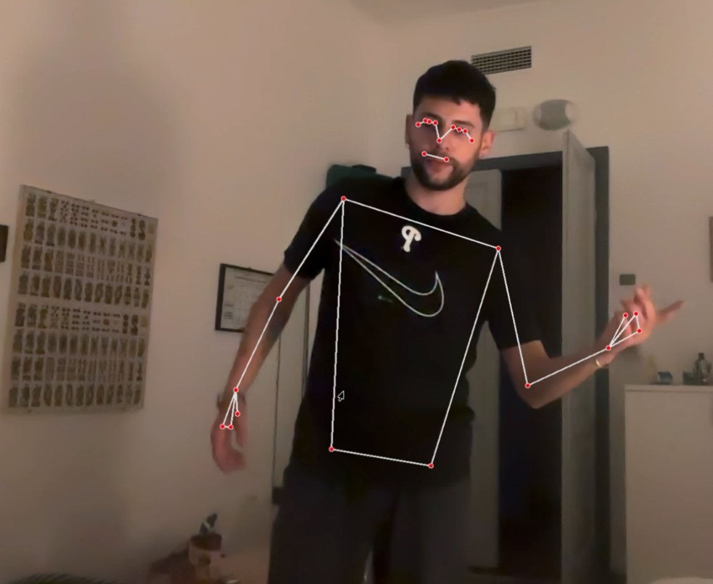
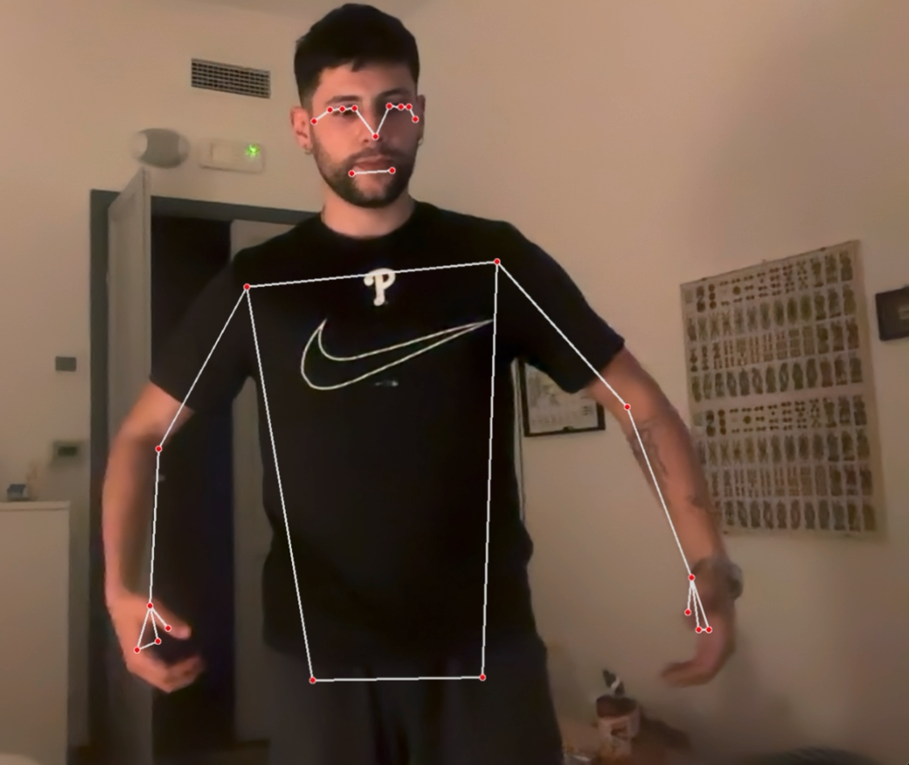

# Personal Experience of Art (PEA) - Babylon Installation

An interactive art installation optimized for **Apple M3** that bridges the gap between the viewer and the artwork through real-time body tracking and narrative audio.

## 🎭 System Overview

This project uses **MediaPipe Holistic** and **OpenCV** to track user poses in real-time. The installation creates a "living" version of the painting *Babylon*, which reacts to the viewer's physical presence and specific body movements.

## 📸 Reference Poses

To unlock the layers of the painting, you must strike the following three poses:

| Pose 1 (First Layer) | Pose 2 (Second Layer) | Pose 3 (Last Layer) |
|:---:|:---:|:---:|
|  |  |  |
| **Triggers Bottom Section** | **Triggers Middle Section** | **Triggers Top Section** |

## 🖼️ How It Works

### 1. Visual Layers
- **The Ghost Layer**: Initially, the painting is seen in a "spirit state"—grayscale and heavily blurred. This represents the hidden stories of the art.
- **The Color Layer**: The original high-resolution masterpiece, hidden beneath the ghost layer.
- **The Hand Torch**: Your index finger acts as a dynamic light source, allowing you to "peek" through the blur at any time.

### 2. Sequential Revelation (The Story Path)
The installation follows a narrative state machine:
1. **Pose 1**: Strike the first reference pose. Once matched, the **Bottom Section** begins a smooth Left-to-Right reveal.
2. **Pose 2**: Strike the second pose to reveal the **Middle Section**.
3. **Pose 3**: Strike the final pose to clear the **Top Section**, revealing the full story of Babylon.

## ⚙️ The Body Tracking Process

The system employs a sophisticated real-time analysis pipeline to ensure accurate and responsive interaction:

### 1. Landmark Detection
Using **MediaPipe Holistic**, the system identifies 33 3D body landmarks. For this installation, we focus on the upper body (shoulders, elbows, and wrists) to provide a stable experience regardless of the user's distance from the camera.

### 2. Angular Analysis
Instead of tracking absolute pixel positions—which vary based on user height and distance—the system calculates the **relative angles** between joints:
- **Shoulder Angle**: Calculated between the Hip, Shoulder, and Elbow.
- **Elbow Angle**: Calculated between the Shoulder, Elbow, and Wrist.

This mathematical approach makes the tracking **scale-invariant**, meaning it works for everyone regardless of body type.

### 3. Real-Time Comparison
The current body angles are compared against a `reference_poses.json` file. 
- **Tolerance**: A 35-degree threshold allows for natural human variation.
- **Hold Logic**: A pose must be maintained for **0.8 seconds**. A visual progress bar appears on-screen to guide the user through the "ceremony" of the reveal.

### 4. Apple M3 Optimization
The processing pipeline is optimized for Apple Silicon, utilizing vectorized operations in **NumPy** and hardware-accelerated **OpenCV** routines to maintain a consistent 30+ FPS even with high-resolution image processing and Gaussian blurs.

## 📁 Project Structure
- `interactive_art.py`: The main installation script.
- `calibrate_poses.py`: A tool to capture and save your own reference poses.
- `reference_poses.json`: Stored joint data for the matching algorithm.
- `babylon.jpg`: The high-resolution art asset.
- `pose1.png`, `pose2.png`, `pose3.png`: Reference pose visual guides.

## 🚀 Getting Started

1. **Install Dependencies**:
   ```bash
   pip install opencv-python mediapipe pygame numpy
   ```
2. **Calibrate (Optional)**:
   Use `calibrate_poses.py` to set your own reference points.
3. **Launch the Installation**:
   ```bash
   python3 interactive_art.py
   ```

---
*Created as an exploration of narrative art and computer vision.*
