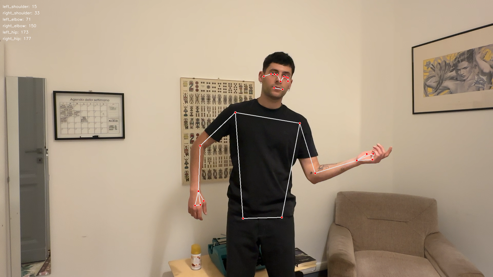
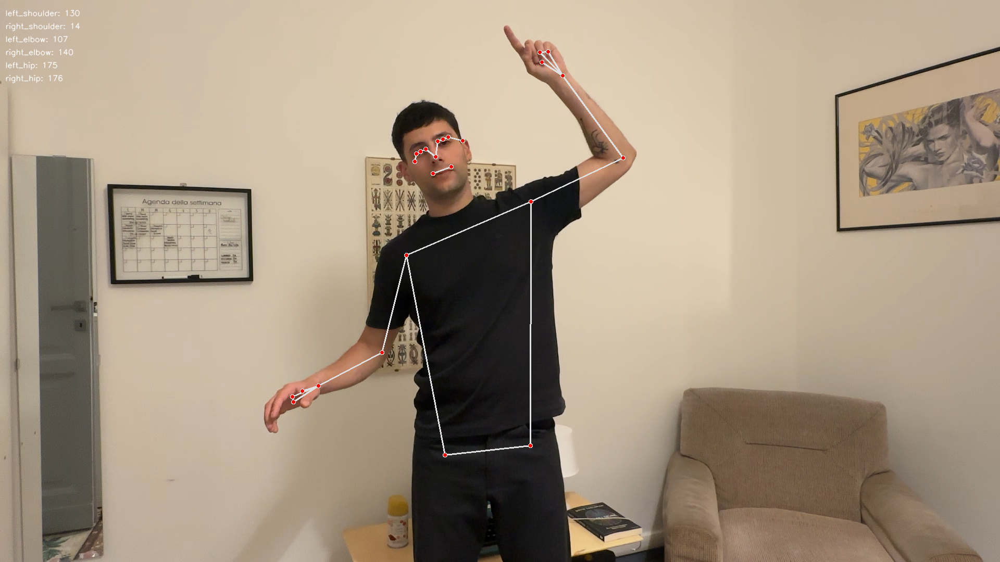

# Personal Experience of Art (PEA) - Babylon Installation

An interactive art installation optimized for **Apple M3** that bridges the gap between the viewer and the artwork through real-time body tracking and narrative audio.

## 🎭 System Overview

This project uses **MediaPipe Holistic** and **OpenCV** to track user poses in real-time. The installation creates a "living" version of the painting *Babylon*, which reacts to the viewer's physical presence through a two-stage "Divine Spark" revelation process.

## 📸 Reference Poses

To unlock the layers of the painting, you must strike specific poses that correspond to figures in the artwork:

| Pose 1 (Section 3) | Pose 2 (Section 2) | Pose 3 (Section 1) |
|:---:|:---:|:---:|
|  |  |  |
| **Triggers Human (Bottom)** | **Triggers San Diego (Mid)** | **Triggers Maria (Top)** |

## 🖼️ How It Works

### 1. Visual Layers
- **The Ghost Layer**: Initially, the painting is heavily blurred (201x201 Gaussian blur) and grayscale, representing a hidden or "liminal" state.
- **The Golden Spark**: Lightning-like lines that flicker and pulse when a pose is successfully matched.
- **The Color Layer**: The high-resolution original artwork, revealed through the "Miracle" sequence.

### 2. The Divine Spark Sequence (The Miracle)
When a pose is matched and held for **0.8 seconds**, the system triggers a two-stage revelation:

- **Stage A: The Spark (2 Seconds)**:
  - Immediate audio feedback (`matchingsound.WAV` + thematic music).
  - A "Golden Shadow" (lightning lines) appears and flickers intensely on top of the blur.
- **Stage B: The Spread (25 Seconds)**:
  - The color "blooms" outward starting specifically from where the shadow lines were located.
  - The boundary uses a "Liquid Wave" effect with smoothstep interpolation and dynamic "dancing" waves for an organic feel.

## 📁 Asset Mapping

The system uses specific masks to drive the lightning and revelation for each section:

| Section | Figure | Target Asset | Lightning Mask |
|:---|:---|:---|:---|
| **Section 3 (Bottom)** | **Human** | `images/human.png` | `images/shadow1.png` |
| **Section 2 (Middle)** | **San Diego** | `images/sandiego.png` | `images/shadow2.png` |
| **Section 1 (Top)** | **Maria** | `images/maria.png` | `images/shadow3.png` |

*Note: `images/shadow1.png`, `images/shadow2.png`, and `images/shadow3.png` are the black images with white lines corresponding to the figures.*

## ⚙️ The Body Tracking Process

### 1. Landmark Detection
The system identifies body landmarks using MediaPipe. We focus on the upper body (shoulders and elbows) to calculate joint angles, making the system **scale-invariant**.

### 2. Matching Logic
- **Tolerance**: A 35-degree threshold allows for natural human variation.
- **State Machine**: The installation follows a sequential path (Bottom -> Middle -> Top) to build a narrative journey.

## 🚀 Getting Started

1. **Install Dependencies**:
   ```bash
   pip install opencv-python mediapipe pygame numpy
   ```
2. **Launch the Installation**:
   ```bash
   python3 interactive_art.py
   ```
3. **Controls**:
   - Strike the pose shown in the reference images.
   - Hold the pose until the progress bar completes.
   - Press **'q'** to exit the installation.

---
*Created as an exploration of narrative art and computer vision.*
